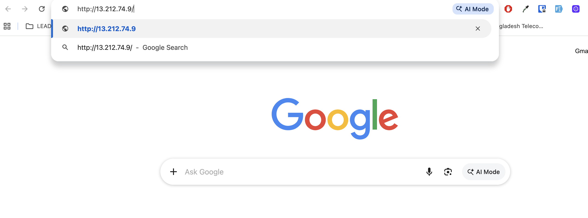
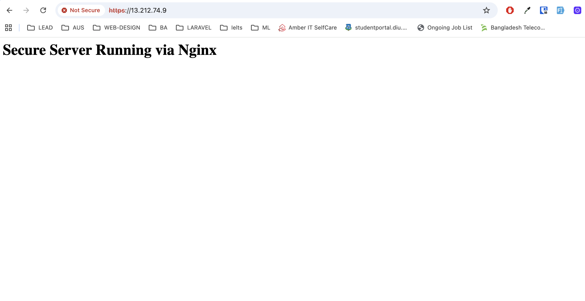
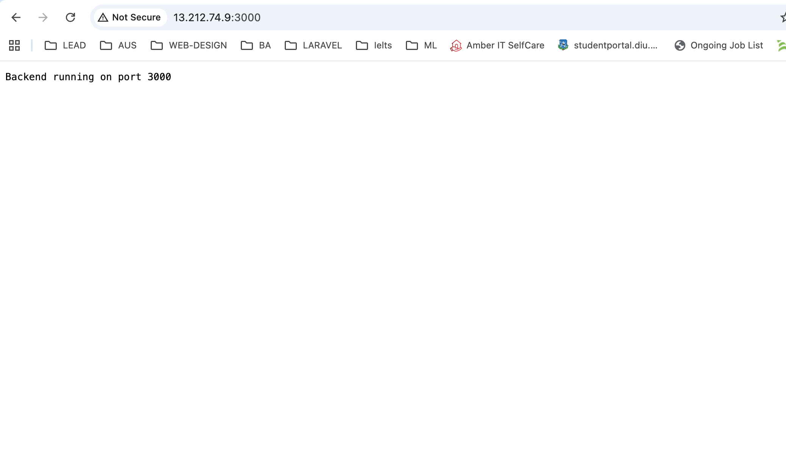
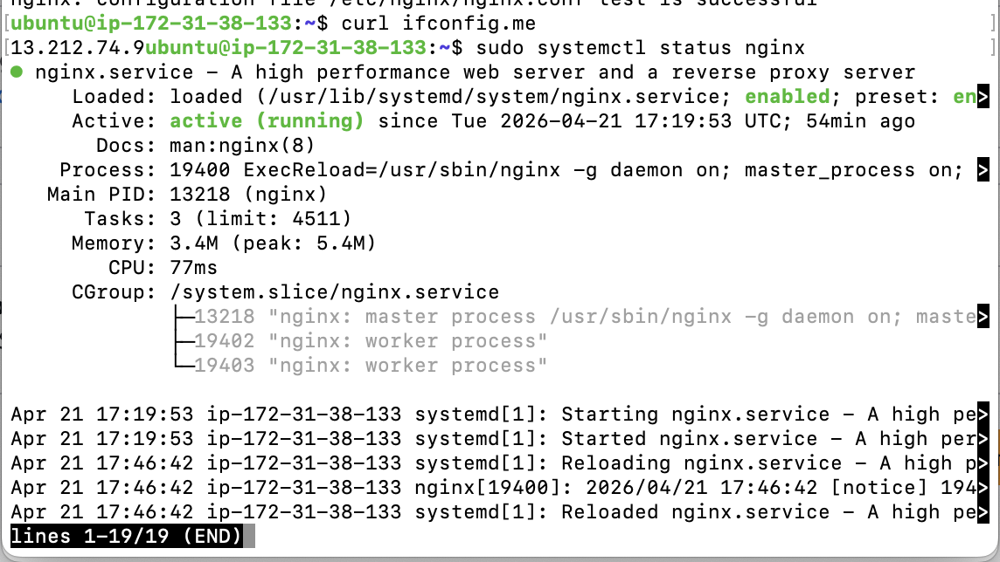

# Nginx Secure Web Server with HTTPS & Reverse Proxy

## Project Overview

This project demonstrates how to set up a **production-like secure web server** using Nginx on a Linux (Ubuntu EC2) instance.

It includes:

* Static website hosting
* HTTPS with self-signed SSL (OpenSSL)
* HTTP → HTTPS redirection
* Reverse proxy to a backend server (Node.js on port 3000)

---

## Setup Steps

### 1. Install Required Packages

```bash
sudo apt update
sudo apt install nginx openssl nodejs npm -y
```

---

### 2. Create Static Website

```bash
sudo mkdir -p /var/www/secure-app
sudo nano /var/www/secure-app/index.html
```

Add:

```html
<h1>Secure Server Running via Nginx</h1>
```

Set permissions:

```bash
sudo chown -R $USER:$USER /var/www/secure-app
```

---

### 3. Generate SSL Certificate (Self-Signed)

```bash
sudo mkdir -p /etc/nginx/ssl

sudo openssl req -x509 -nodes -days 365 -newkey rsa:2048 \
-keyout /etc/nginx/ssl/nginx.key \
-out /etc/nginx/ssl/nginx.crt
```

---

### 4. Configure Nginx

Create config file:

```bash
sudo nano /etc/nginx/sites-available/secure-app
```

Add:

```nginx
# Redirect HTTP → HTTPS
server {
    listen 80;
    server_name 13.212.74.9;

    return 301 https://$host$request_uri;
}

# HTTPS Server
server {
    listen 443 ssl;
    server_name 13.212.74.9;

    ssl_certificate /etc/nginx/ssl/nginx.crt;
    ssl_certificate_key /etc/nginx/ssl/nginx.key;

    root /var/www/secure-app;
    index index.html;

    location / {
        try_files $uri $uri/ =404;
    }

    location /api/ {
        proxy_pass http://localhost:3000/;
        proxy_set_header Host $host;
        proxy_set_header X-Real-IP $remote_addr;
    }
}
```

Enable config:

```bash
sudo ln -s /etc/nginx/sites-available/secure-app /etc/nginx/sites-enabled/
sudo rm /etc/nginx/sites-enabled/default
```

---

### 5. Create Backend Server (Node.js)

Create file:

```bash
nano server.js
```

Add:

```javascript
const http = require('http');

http.createServer((req, res) => {
  console.log("Request received");
  res.writeHead(200, {'Content-Type': 'text/plain'});
  res.end('Backend running on port 3000');
}).listen(3000, () => {
  console.log("Server running on port 3000");
});
```

Run:

```bash
node server.js
```

---

### 6. Configure AWS Security Group

Inbound Rules:

| Type       | Port | Source    |
| ---------- | ---- | --------- |
| HTTP       | 80   | 0.0.0.0/0 |
| HTTPS      | 443  | 0.0.0.0/0 |
| Custom TCP | 3000 | 0.0.0.0/0 |

---

### 7. Test & Reload Nginx

```bash
sudo nginx -t
sudo systemctl reload nginx
```

---

## Testing Results

### HTTP → HTTPS Redirect

```
http://13.212.74.9
```


➡️ Redirects to:

```
https://13.212.74.9
```

---

### HTTPS Working

```
https://13.212.74.9
```


---

### Backend via Nginx Reverse Proxy

```
https://13.212.74.9/api/
```

Output:

```
Backend running on port 3000
```


---

## Screenshots

### 1. HTTPS Working in Browser


### 2. HTTP to HTTPS Redirect


### 3. Backend Response


### 4. Nginx Status (`systemctl status nginx`)



---

## Key Concepts Learned

* Nginx server configuration
* SSL/TLS setup with OpenSSL
* Reverse proxy implementation
* AWS EC2 networking & security groups
* Debugging connectivity issues

---

## Conclusion

This setup successfully demonstrates a secure and scalable web server architecture using Nginx with HTTPS and reverse proxy capabilities.

---
